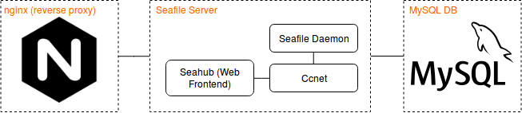

[](https://GitHub.com/Naereen/StrapDown.js/graphs/commit-activity)

# Seafile Docker ARM64

## About

This is a set of scripts and Dockerfiles for setting up [Seafile](https://www.seafile.com/en/home/) in docker.

The Seafile Maintainers provide a dockerized setup themselves (https://github.com/haiwen/seafile-docker), but that one is not compatible with ARM devices.

## Overview



We use three main docker images to separate the different components from each other.
- **nginx** acts as a reverse proxy for the main seafile server w/ seahub.
- **seafile** is the main application, built and packaged using the procedure described [in the official manual](https://manual.seafile.com/build_seafile/rpi.html).

   *Note:* Building and packaging is done seperately, inside the **build** image.
- **mysql** is the application database.

## Prerequisites

### Hardware Prerequisites

- CPU with **ARMv8 64-bit** archicture (e.g. SBCs listed below)
- **\>= 1 GB of RAM**, *Recommended*: ~= 4 GB of RAM (needed for compilation of lxml)
- *Recommended*: >= **30 GB of disk space** per user

**Note**: If your Hardware doesn't have enough RAM,
you have to rely on the [official seafile builds for Raspberry Pi](https://github.com/haiwen/seafile-rpi). Just grab the latest release, uncompress it
and place it inside `build/src`:

```bash
SERVER_VERSION=6.3.4
wget https://github.com/haiwen/seafile-rpi/releases/download/v${SERVER_VERSION}/seafile-server_${SERVER_VERSION}_stable_pi.tar.gz
tar -xzf seafile-server_*.tar.gz
rm seafile-server_*.tar.gz
mv seafile-server* build/src/seafile-server
```

Additionally, you will have to comment out the whole `baseimage` target inside `docker-compose.yml`:

```yaml
services:
#    baseimage:
#        build:
#            context: build
#            args:
#              - "SERVER_VERSION=7.0.0"
#        image: jojo243/seafile-base
#        container_name: seafile_base
#        volumes:
#            - ./build/src:/haiwen
    seafile:
        build:
            ...
        ...
```

Specifically, this setup has been tested on:

- [Raspberry Pi 3 Model B+](https://www.raspberrypi.org/products/raspberry-pi-3-model-b-plus/)
- [Rock64](https://www.pine64.org/devices/single-board-computers/rock64/)

### Software Prerequisites

- An OS with working Docker (e.g. Raspbian, Ubuntu)
- [Docker](https://docs.docker.com/install/linux/docker-ce/debian/)
- [docker-compose](https://docs.docker.com/compose/install/)
- make

It's heavily recommended to add your user to the `docker` group,
otherwise you will have to put `sudo` in front of every docker command.

```bash
sudo usermod -aG docker $USER
```

Log out and back in again for the change to take effect.

## Getting Started

First of all, make sure you meet the [Requirements](#Prerequisites). Then fork or clone this repo:

```bash
git clone https://github.com/jojo243/seafile-docker-arm64.git
cd seafile-docker-arm64
```

## Configuration

Make yourself familiar with the `docker-compose.yml`. Most of the configuration
is done there. Note the instructions and hints inside the `docker-compose.yml`
and adapt everything to your needs (The least thing you probably want to do is
change the server name).

See the table below for detailed instrucions.

| Variable Name     | Example           | Description                    |
| ----------------- | ----------------- | ------------------------------ |
| SERVER_NAME       | www.example.org   | IP Address or hostname where the server can be accessed. **Set this twice**\*. |
| PORT              | 8080              | Port where the server can be accessed. **Set this twice**\*. |
| MYSQL_ROOT_PASSWD | ***************** | MySQL root password. **Set this twice**\*. |
| MYSQL_USER_PASSWD | 12345678          | MySQL user password. Not needed most of the time. |
| ADMIN_EMAIL       | admin@example.org | Email of the admin account.    |
| ADMIN_PASSWORD    | ***************** | Password of the admin account. |
| SSL               | 1                 | Whether to use SSL (0/1). **Set this twice**\*.     |

\* This variable has to be set to the same value in two places inside the `docker-compose.yml`.

### SSL Configuration

To enable SSL (https:\/\/SERVER_NAME:PORT)

1. Set `SSL` to 1.
2. Create a folder name `ssl` inside `nginx`.

    ```bash
    mkdir -p nginx/ssl
    ```
3. Copy your SSL Certs (`fullchain.pem` and `privkey.pem`) as well as a
DH params file (`dhparams.pem`) into that directory.
If you don't have such files, follow the instructions
[here](https://certbot.eff.org/lets-encrypt/) (SSL Certs) and
[here](https://weakdh.org/sysadmin.html) (DH params). The following command
should do the trick for the last one:

    ```bash
    openssl dhparam 2048 > nginx/ssl/dhparam.pem
    ```

4. Make sure your user owns the SLL folder:

    ```bash
    sudo chown -R $USER ssl
    ```

## Building

Make sure you adapted everything inside the `docker-compose.yml` according to
your needs. Now build the whole thing (this may take a while):

```bash
make 1
```

It's recommended to run the first startup in foreground so you can
see what's going on.

```bash
make up
```

After the startup procedure (it may take a while when first starting seafile)
you can access the seahub webinterface at http(s):\/\/SERVER_NAME:PORT.
Log in with your ADMIN_EMAIL and ADMIN_PASSWORD.
After that, change your ADMIN_PASSWORD via webinterface.

## Running

Start Seafile in background.

```bash
make
```

You can now access the seahub webinterface at http(s):\/\/SERVER_NAME:PORT.
Seafile will start up automatically, you wont need start it everytime you boot up your system.

## Stopping

```bash
make 3
```

## Troubleshooting

- `Error 502: Bad Gateway.`
    Most likely, seahub is not started.

    ```
    docker-compose exec seafile bash -c "cd seafile-server-latest && ./seahub.sh start"
    ```
